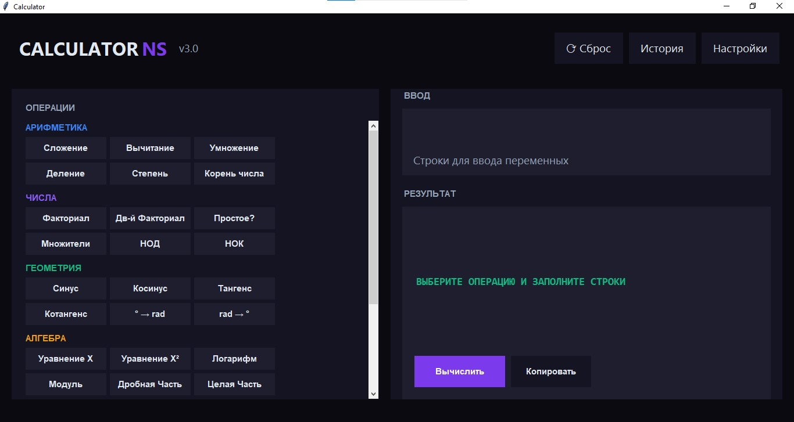
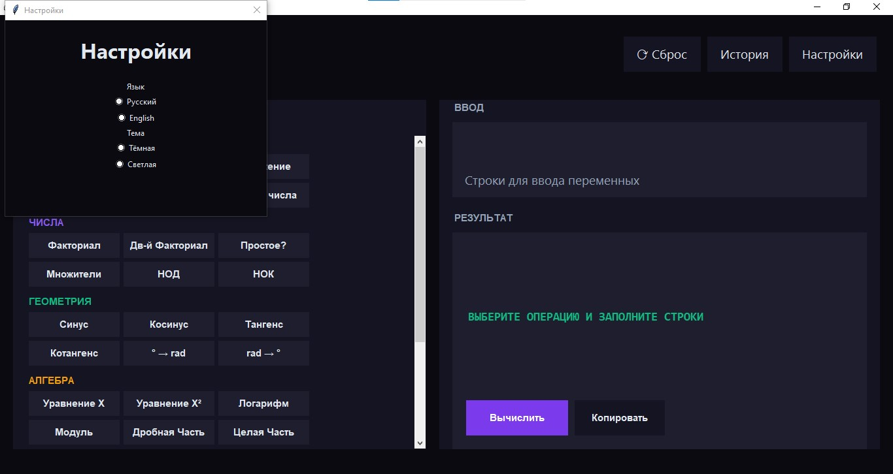
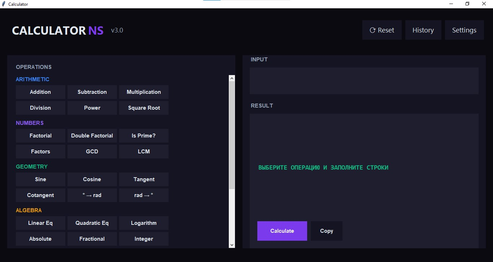
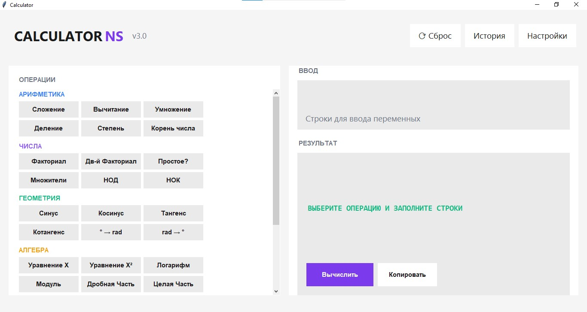
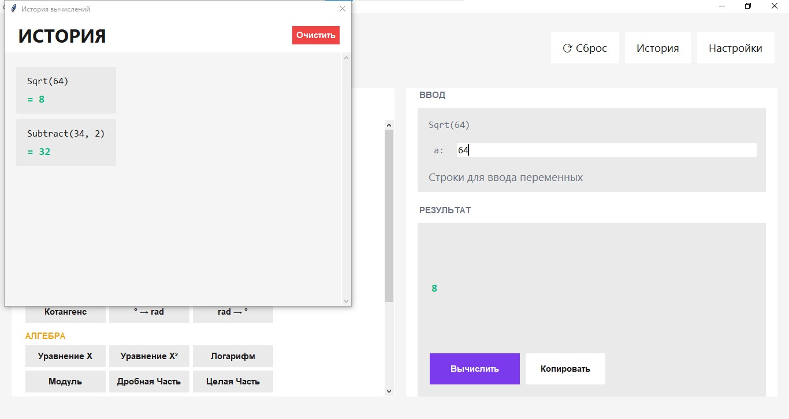
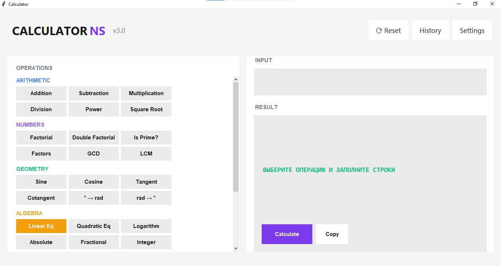

# Calculator v.3

Advanced calculator: themes, language settings. 

## 💻 Run:
- Download [Calculator_v.3.exe](Calculator_v.3.exe)
  
- Or run [Calculator_v.3.py](Calculator_v.3.py)

## 💾 Code comments:
- 🇷🇺 Russian version: [Comments](Calc_v.3_com_RU.py)
  
- 🇺🇲 English version: [Comments](Calc_v.3_com_EN.py)

## 📄 Full documentation:
- 🇷🇺  Russian version [Documentation](Calculator_v.3_RU.md)
  
- 🇺🇲  English version: [Documentation](Calculator_v.3_EN.md)

## 📷 Screenshots:

© NebulaStack
