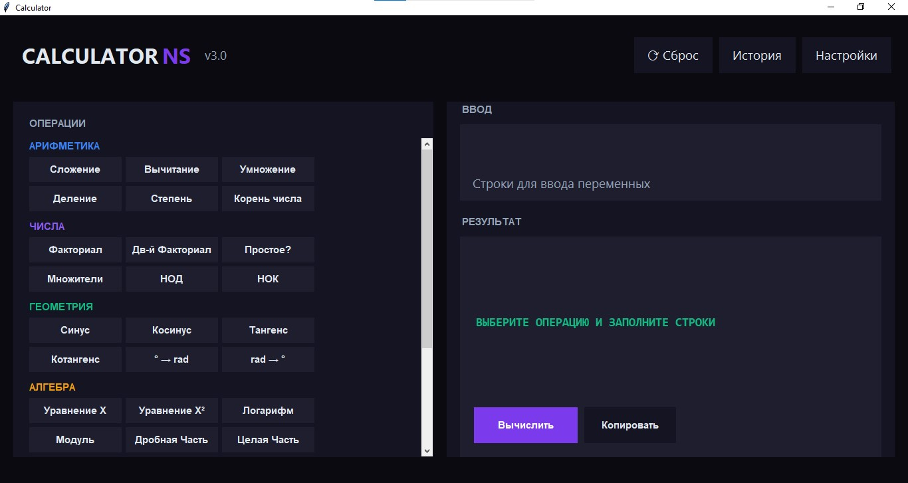
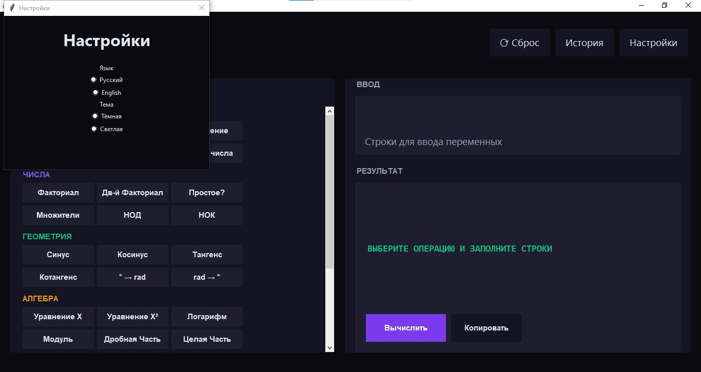
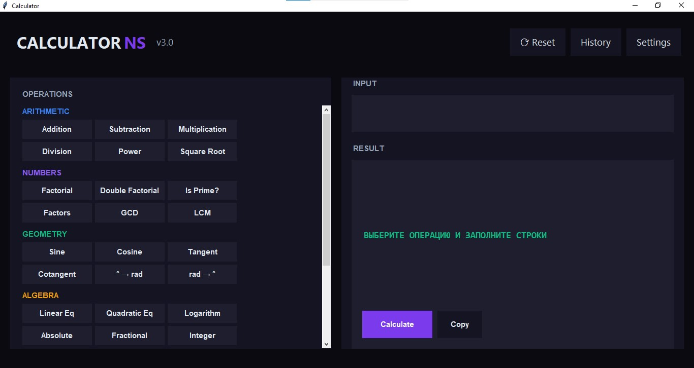
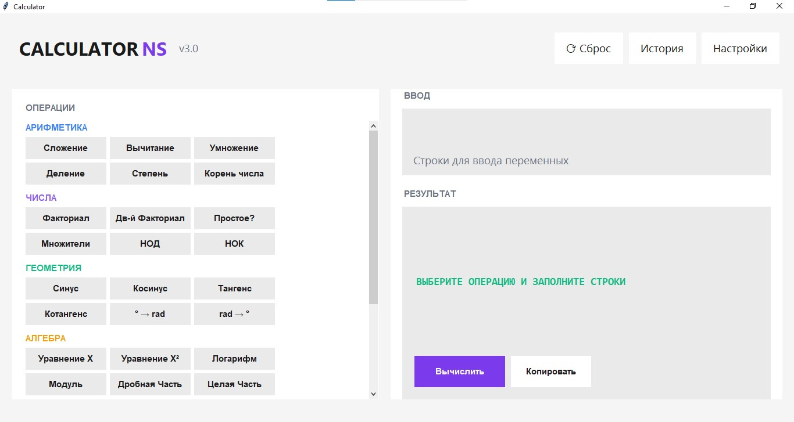
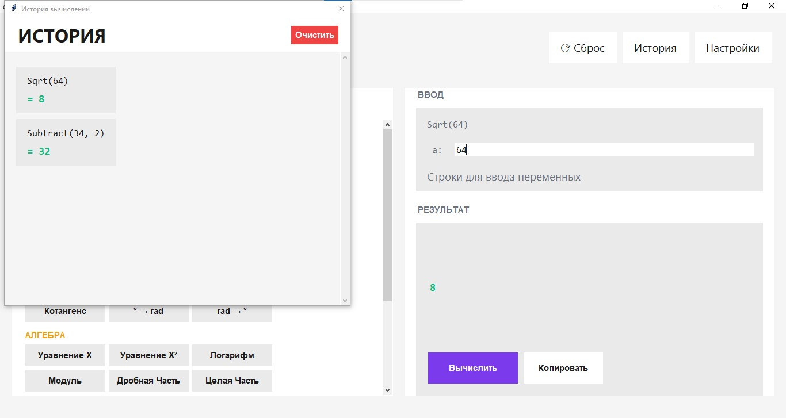
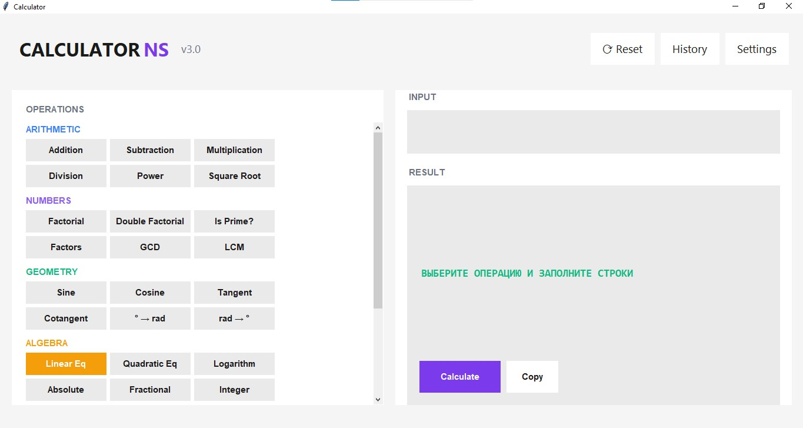

# Calculator v.3

Advanced calculator: themes, language settings. 

## 💻 Project Run
- Open with Python: [Calculator_v.3.py](Calculator_v.3.py)

- Or download exe: [Calculator_v.3.exe](https://github.com/NebulaStack-prog/Calculator-v.3/releases/tag/v1.0)

## 📄 Full Documentation
- 🇷🇺  Russian version [Documentation](Calculator_v.3_RU.md)
  
- 🇺🇲  English version: [Documentation](Calculator_v.3_EN.md)

## 📷 Screenshots

© NebulaStack
